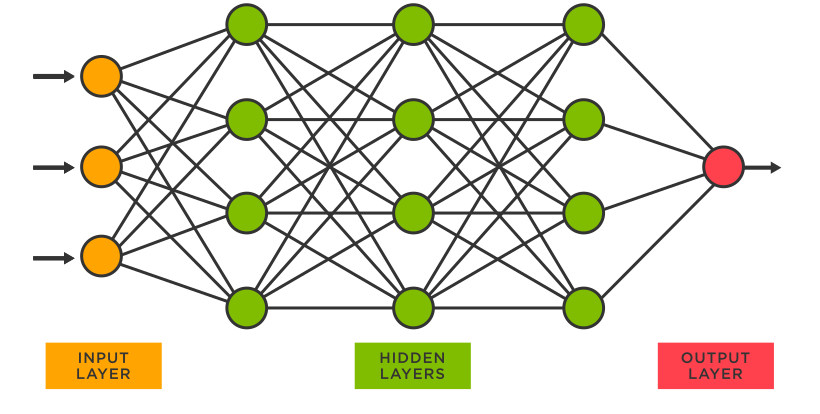

# Training a neural network



In order to train a neural network, you need to install the `tensorflow` library and call it like this

```python
import tensorflow as tf
print("TensorFlow version:", tf.__version__)
```

Then you train the network using these commands

```python
mnist = tf.keras.datasets.mnist

(x_train, y_train), (x_test, y_test) = mnist.load_data()
x_train, x_test = x_train / 255.0, x_test / 255.0

model = tf.keras.models.Sequential([
  tf.keras.layers.Flatten(input_shape=(28, 28)),
  tf.keras.layers.Dense(128, activation='relu'),
  tf.keras.layers.Dropout(0.2),
  tf.keras.layers.Dense(10)
])
```

### Exercise 1

Write code to make predictions

**Answer.**

```python
predictions = model(x_train[:1]).numpy()
predictions
```
